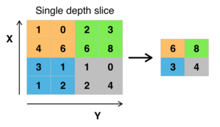

# Max Pooling and Flattening

## What is pooling

*Pooling is nothing other than down sampling of an image. The most common pooling layer filter is of size 2x2, which discards three forth of the activations. Role of pooling layer is to reduce the resolution of the feature map but retaining features of the map required for classification through translational and rotational invariants.*\
*A pooling layer is a new layer added after the convolutional layer. Specifically, after a nonlinearity (e.g. ReLU) has been applied to the feature maps output by a convolutional layer*\
*Pooling involves selecting a pooling operation, much like a filter to be applied to feature maps. The size of the pooling operation or filter is smaller than the size of the feature map; specifically, it is almost always 2×2 pixels applied with a stride of 2 pixels.\
*This means that the pooling layer will always reduce the size of each feature map by a factor of 2, e.g. each dimension is halved, reducing the number of pixels or values in each feature map to one quarter the size. For example, a pooling layer applied to a feature map of 6×6 (36 pixels) will result in an output pooled feature map of 3×3 (9 pixels)*

## Need for pooling

*1.Pooling layers are used to reduce the dimensions of the feature maps. Thus, it reduces the number of parameters to learn and the amount of computation performed in the network.\
2.The pooling layer summarises the features present in a region of the feature map generated by a convolution layer. So, further operations are performed on summarised features instead of precisely positioned features generated by the convolution layer. This makes the model more robust to variations in the position of the features in the input image.*

## *Types of pooling*

**Max pooling-Max pooling is a pooling operation that selects the maximum element from the region of the feature map covered by the filter. Thus, the output after max-pooling layer would be a feature map containing the most prominent features of the previous feature map**



**Mean pooling-where we take largest of the pixel values of a segment**


**Avg pooling-Average pooling computes the average of the elements present in the region of feature map covered by the filter. Thus, while max pooling gives the most prominent feature in a particular patch of the feature map, average pooling gives the average of features present in a patch.**


**Stochastic pooling**: Randomly picked activation within each pooling region is considered than deterministic pooling operations for regularization of the network. Stochastic pooling performs reduction of feature size but denies role for selecting features judiciously for the sake of regularization. Although clipping of negative output from ReLU activation helps to carry some of the selection responsibility.

**Overlapping pooling**: Overlapping pooling operation shares responsibility of local connection beyond the size of previous convolutional filter, which breaks orthogonal responsibility between pooling layer and convolutional layer. So, no information is gained if pooling windows overlap

**Fractional pooling**:Reduction ratio of filter size due to pooling can be controlled by a fractional pooling concept, which helps to increase the depth of the network. Unlike stochastic pooling, the randomness is related to the choice of pooling regions, not the way pooling is performed inside each of the pooling regions*

**Global pooling**-Global pooling reduces each channel in the feature map to a single value. Thus, an nh x nw x nc feature map is reduced to 1 x 1 x nc feature map. This is equivalent to using a filter of dimensions nh x nw i.e. the dimensions of the feature map.
Further, it can be either global max pooling or global average pooling.*

## Working of Max pooling


*Maximum pooling, or max pooling, is a pooling operation that calculates the maximum, or largest, value in each patch of each feature map.\
The results are down sampled or pooled feature maps that highlight the most present feature in the patch, not the average presence of the feature in the case of average pooling\
We can make the max pooling operation concrete by again applying it to the output feature map of the line detector convolutional operation and manually calculate the first row of the pooled feature map.\
The first line for pooling (first two rows and six columns) of the output feature map were as follows:\
[0.0, 0.0, 3.0, 3.0, 0.0, 0.0]\
[0.0, 0.0, 3.0, 3.0, 0.0, 0.0]*

*The first max pooling operation is applied as follows:\
max(0.0, 0.0) = 0.0\
        0.0, 0.0\
Given the stride of two, the operation is moved along two columns to the left and the max is calculated:\
max(3.0, 3.0) = 3.0\
    3.0, 3.0\
Again, the operation is moved along two columns to the left and the max is calculated:\
max(0.0, 0.0) = 0.0\
    0.0, 0.0\
That’s it for the first line of pooling operations.\
The result is the first line of the max pooling operation:\
[0.0, 3.0, 0.0]\
Again, given the horizontal symmetry of the feature map provided for pooling, we would expect the pooled feature map to look as follows:\
[0.0, 3.0, 0.0]\
[0.0, 3.0, 0.0]\
[0.0, 3.0, 0.0]\
It just so happens that the chosen line detector image and feature map produce the same output when downsampled with average pooling and maximum pooling.*

## **What is flattening**
*Flattening is converting the data into a 1-dimensional array for inputting it to the next layer. We flatten the output of the convolutional layers to create a single long feature vector. And it is connected to the final classification model, which is called a fully-connected layer. In other words, we put all the pixel data in one line and make connections with the final layer.* 

## Working of flattening

*A tensor flatten operation is a common operation inside convolutional neural networks. This is because convolutional layer outputs that are passed to fully connected layers must be flatted out before the fully connected layer will accept the input.*

*To flatten a tensor, we need to have at least two axes. This makes it so that we are starting with something that is not already flat. Let's look now at a hand written image of an eight from the MNIST dataset. This image has 2 distinct dimensions, height and width.*


*The height and width are 18 x 18 respectively. These dimensions tell us that this is a cropped image because the MNIST dataset contains 28 x 28 images. Let's see now how these two axes of height and width are flattened out into a single axis of length 324.\
The image above shows our flattened output with a single axis of length 324. The white on the edges corresponds to the white at the top and bottom of the image.\
In this example, we are flattening the entire tensor image, but what if we want to only flatten specific axes within the tensor? This is typically required when working with CNNs.*


```python

```
