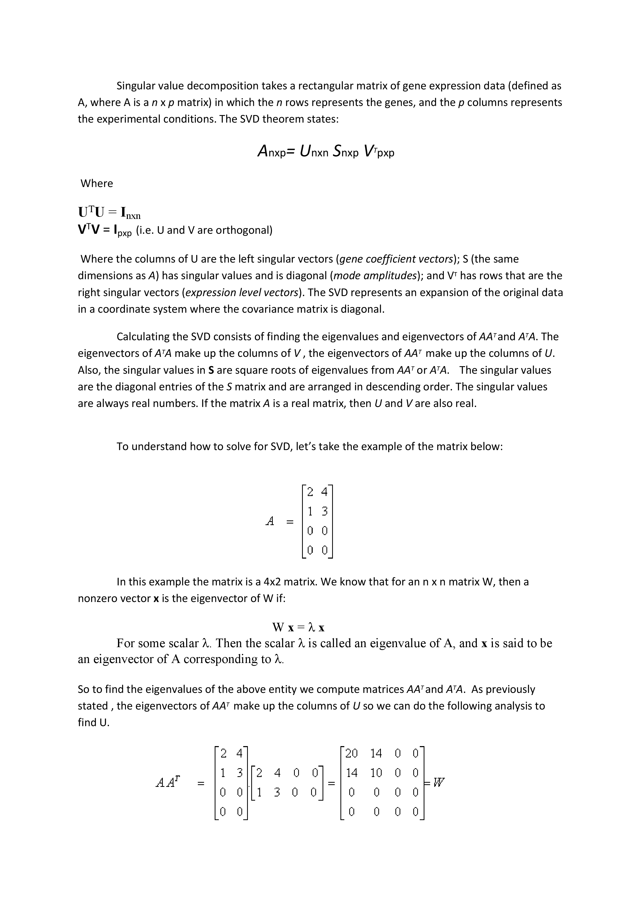
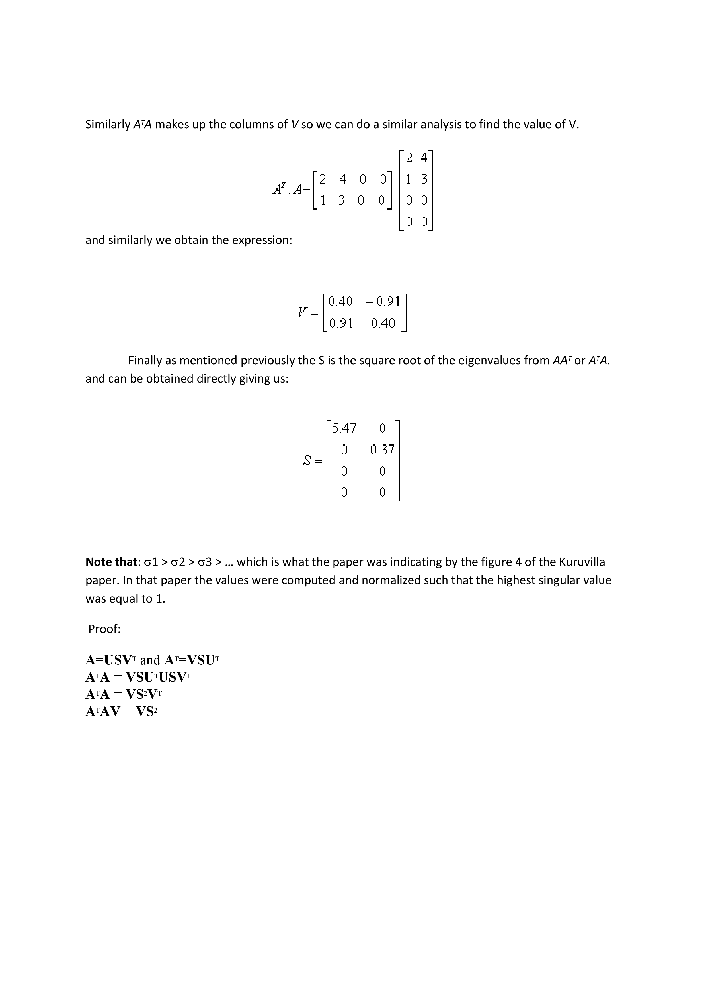
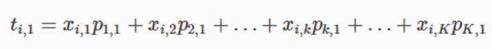
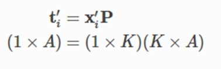
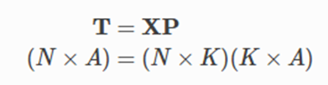

# 1.Principle Component Analysis

## a. Demensionality reduction

*The number of input features, variables, or columns present in a given dataset is known as dimensionality, and the process to reduce these features is called dimensionality reduction.* 

*A dataset contains a huge number of input features in various cases, which makes the predictive modeling task more complicated. Because it is very difficult to visualize or make predictins for the training dataset with a high number of features, for such cases, dimensionality reduction techniques are required to use.*

*Dimensionality reduction technique can be defined as, "It is a way of converting the higher dimensions dataset into lesser dimensions dataset ensuring that it provides similar information." These techniques are widely used in machine learning for obtaining a better fit predictive model while solving the classification and regression problems.*

*It is commonly used in the fields that deal with high-dimensional data, such as speech recognition, signal processing, bioinformatics, etc. It can also be used for data visualization, noise reduction, cluster analysis, etc.*

#####   The Curse of Dimensionality

    Handling the high-dimensional data is very difficult in practice, commonly known as the curse of dimensionality. If the dimensionality of the input dataset increases, any machine learning algorithm and model becomes more complex. As the number of features increases, the number of samples also gets increased proportionally, and the chance of overfitting also increases. If the machine learning model is trained on high-dimensional data, it becomes overfitted and results in poor performance.
    
    Hence, it is often required to reduce the number of features, which can be done with dimensionality reduction.

##### Benefits of applying Dimensionality Reduction

Some benefits of applying dimensionality reduction technique to the given dataset are given below:

*	By reducing the dimensions of the features, the space required to store the dataset also gets reduced.
*	Less Computation training time is required for reduced dimensions of features.
*	Reduced dimensions of features of the dataset help in visualizing the data quickly.
*	It removes the redundant features (if present) by taking care of multicollinearity.

 ##### Disadvantages of dimensionality Reduction

There are also some disadvantages of applying the dimensionality reduction, which are given below:

*	Some data may be lost due to dimensionality reduction.
*	In the PCA dimensionality reduction technique, sometimes the principal components required to consider are unknown

## b. Singular Value Decomposition

## C. Principal Component Analysis

    
   Principal component analysis (PCA) is the dimensionality reduction technique which has so many utilities. PCA reduces the dimensions of a dataset by projecting the data onto a lower-dimensional subspace. For example, a 2D dataset could be reduced by projecting the points onto a line. Each instance in the dataset would then be represented by a single value, rather than a pair of values. In a similar way, a 3D dataset could be reduced to two dimensions by projecting variables onto a plane. PCA has the following utilities:
    
*	Mitigate the course of dimensionality
*	Compress the data while minimizing the information lost at the same time
*	Principal components will be further utilized in the next stage of supervised learning, in random forest, boosting, and so on
*	Understanding the structure of data with hundreds of dimensions can be difficult, hence, by reducing the dimensions to 2D or 3D, observations can be visualized easily

    PCA can easily be explained with the following diagram of a mechanical bracket which has been drawn in the machine drawing module of a mechanical engineering course. The left-hand side of the diagram depicts the top view, front view, and side view of the component. However, on the right-hand side, an isometric view has been drawn, in which one single image has been used to visualize how the component looks. So, one can imagine that the left-hand images are the actual variables and the right-hand side is the first principal component, in which most variance has been captured.
    
    Finally, three images have been replaced by a single image by rotating the axis of direction. In fact, we replicate the same technique in PCA analysis.

Principal component working methodology is explained in the following sample example, in which actual data has been shown in a 2D space, in which X and Y axis are used to plot the data. Principal components are the ones in which maximum variation of the data is captured.

The following diagram illustrates how it looks after fitting the principal components. The first principal component covers the maximum variance in the data and the second principal component is orthogonal to the first principal component, as we know all principal components are orthogonal to each other. We can represent whole data with the first principal component itself. In fact, that is how it is advantageous to represent the data with fewer dimensions, to save space and also to grab maximum variance in the data, which can be utilized for supervised learning in the next stage. This is the core advantage of computing principal components.

#### Mathematical derivation for PCA

Geometrically, when finding the best-fit line for the swarm of points, our objective was to minimize the error, i.e. the residual distances from each point to the best-fit line is the smallest possible. This is also mathematically equivalent to maximizing the variance of the scores, tata.

We briefly review here what that means. Let x′ixi′ be a row from our data, so x′ixi′ is a 1×K1×K vector. We defined the score value for this observation as the distance from the origin, along the direction vector, p1p1, to the point where we find the perpendicular projection onto p1p1. This is illustrated below, where the score value for observation xixi has a value of ti,1ti,1.

Recall from geometry that the cosine of an angle in a right-angled triangle is the ratio of the adjacent side to the hypotenuse. But the cosine of an angle is also used in linear algebra to define the dot-product. Mathematically:

where ∥⋅∥ indicates the length of the enclosed vector, and the length of the direction vector, p1 is 1.0, by definition.

Note that ti,1=x′ip1ti,1=xi′p1 represents a linear combination

So ti,1ti,1 is the score value for the ithith observation along the first component, and is a linear combination of the ithith row of data, xixi and the direction vector p1p1. Notice that there are KK terms in the linear combination: each of the KK variables contributes to the overall score.

We can calculate the second score value for the ith observation in a similar way:

And so on, for the third and subsequent components. We can compactly write in matrix form for the ithith observation that:

which calculates all AA score values for that observation in one go. This is exactly what we derived earlier in the example with the 4 thermometers in the room.
Finally, for an entire matrix of data, XX, we can calculate all scores, for all observations:

Thanks for Reading ! @ Bindu G
